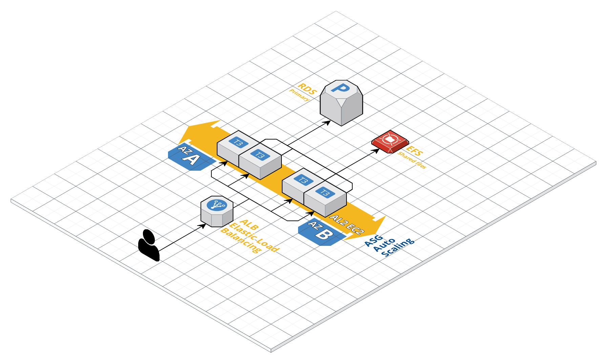

# Overview
Idea of this codebase is to showcase HA deployment of any web app that can work in Docker without utilizing managed container services.
(codebase is opionanted towards wordpress - details in [user-data.tpl @ L19](./modules/asg/tpl/user-data.tpl)).



Important moving parts of the codebase:
* `ASG` - autoscaling group used to orchestrate AL2 EC2 instances used for the web app
* `ALB` - loadbalancer used to handle traffic of the ASG
* `EFS` - elastic file system used as NFS mount to share data volumes in `ASG` EC2 instances
* `RDS` - single MySQL RDS instance used for DB layer. HA could be implemented by utilizing additional replicas.

# Security

Only externally accessible point of the infrastructure is [ALB](./modules/alb), it exposes `tcp/80` to `0.0.0.0/0` in order to allow HTTP traffic.
  
[RDS](./modules/rds) and [EFS](./modules/efs) are private, accessible only from the VPC by `ASG` security group.

Database password is generated randomly utilizing [TF random_password resource](https://registry.terraform.io/providers/hashicorp/random/latest/docs/resources/password).
  
Once the password is generated, it's stored as `SecureString` SSM parameter.
  
EC2 instance reads the password in [user-data](./modules/asg/tpl/user-data.tpl) and injects it directly in the Docker container. The password is not exposed in the instance itself.

> Even tho codebase is opinionated towards wordpress, simply by modifying [user-data.tpl](./modules/asg/tpl/user-data.tpl) would allow you to run any docker image.
# Deployment steps

In order to deploy this codebase to AWS you must have following installed/setup:
1. [AWS Account /w IAM user that has required IAM permissions](https://aws.amazon.com/resources/create-account/)
2. [AWS CLI](https://docs.aws.amazon.com/cli/latest/userguide/cli-chap-install.html) with credentials configured
3. [Terraform](https://www.terraform.io/downloads.html)

Once everything from above is setup, following steps are needed to deploy resources:
```shell script
# Create S3 bucket for Terraform state
# Not required if the bucket already exists
aws s3 mb s3://<any-unique-name-for-tf-state-bucket>

# Init terraform state, provider and modules
# Either use bucket created above or existing one for `bucket` in `backend-config`
terraform init -backend-config="bucket=<any-unique-name-for-tf-state-bucket>" -backend-config="region=eu-west-1"

# Optionally, create `terraform.tfvars` file to override any of the variables from `variables.tf`
touch terraform.tfvars
vi terraform.tfvars # add overrides

# Apply terraform to deploy resources
terraform apply
# Once the apply command is executed, you will see `app_url` Output where your app is deployed and live.
```
> Utilizing [Terraform workspaces](https://www.terraform.io/docs/state/workspaces.html) is a good idea if you plan on deploying multiple instances of this codebase in the same account.
  
> At the very least, you have to specify 2 variables without default values, check [terraform.tfvars.example](terraform.tfvars.example) for more details.
  
> For list of all Terraform variables scroll down to `Terraform details` section.

# Terraform details

## Requirements

No requirements.

## Providers

| Name | Version |
|------|---------|
| aws | n/a |

## Inputs

| Name | Description | Type | Default | Required |
|------|-------------|------|---------|:--------:|
| asg\_cpu\_metric\_down\_threshold | CPUUtilization Auto scaling policy metric threshold to scale-down. | `string` | `"10"` | no |
| asg\_cpu\_metric\_period | CPUUtilization Auto scaling policy metric period in seconds. | `string` | `"60"` | no |
| asg\_cpu\_metric\_up\_threshold | CPUUtilization Auto scaling policy metric threshold to scale-up. | `string` | `"40"` | no |
| asg\_desired\_capacity | Desired capacity of the ASG. | `number` | `1` | no |
| asg\_instance\_type | Instance type of the ASG. | `string` | `"t3.micro"` | no |
| asg\_max\_size | Maximum size of the ASG. | `number` | `5` | no |
| asg\_min\_size | Minimum size of the ASG. | `number` | `1` | no |
| db\_engine\_version | Version of the MySQL engine to use. | `string` | `"5.7.30"` | no |
| db\_instance\_class | Instance class used for the RDS. | `string` | `"db.m3.medium"` | no |
| db\_name | The DB name to create. | `string` | n/a | yes |
| db\_username | Username for the master DB user. | `string` | `"dbuser"` | no |
| env | Name of the environment resources are deployed to. (ex. my-super-project-dev) | `string` | n/a | yes |
| region | Region where AWS provider will be initialized. | `string` | `"eu-west-1"` | no |
| subnets\_to\_use | List of default subnets to use. | `list(string)` | <pre>[<br>  "a",<br>  "b",<br>  "c"<br>]</pre> | no |

## Outputs

| Name | Description |
|------|-------------|
| app\_dns\_name | DNS Name of the App ALB. |
| app\_url | URL of the App. |

